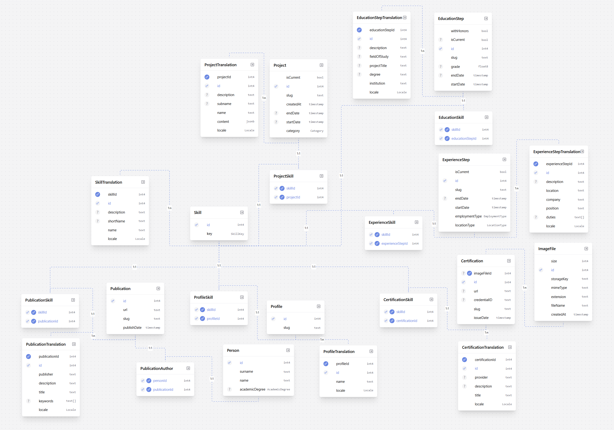

# Oskar Szkurłat — Portfolio

_A full-stack & mechatronics engineer_  
_Version: 2026-06-28_

---

## 📘 About the Project

This portfolio is a **fully custom-built web application designed to represent my professional journey across software engineering, frontend development, and industrial automation**.

It is not just a static showcase of projects — it is a **data-driven, interactive system** that models my entire professional profile through a structured relational database and dynamically generated UI.

The goal of this project is to demonstrate not only what I have built, but more importantly:

- how I design systems,
- how I structure complex data,
- and how I approach frontend architecture at scale.

The application is powered by a custom **PostgreSQL + Prisma** schema, supporting multilingual content, skill relationships, and rich content modeling across projects, experience, education, certifications, and publications.

---

## 🚀 Features

- 🧠 **Skill-based Tag System** — entire content is connected through a normalized skill metadata
- 🔍 **Advanced Filtering & Search Models** — explore content by role, technology, or skill set
- 🌐 **Full Multilingual Support (PL / EN)** — structured i18n at database level
- 🧩 **Custom Component System** — UI built entirely without external component libraries
- 💾 **Rich Content Modeling** — projects, experience, education, certifications, publications
- ⚡ **Type-safe Full-stack Architecture** — prisma-generated schema used across the entire stack

---

## 🧩 Tech Stack

| Category | Technology |
|-----------|-------------|
| Framework | **Next**, **React** |
| Language | **TypeScript** |
| ORM | **Prisma** |
| DataBase | **PostgreSQL** |
| Styling | **SASS Modules** |
| Deployment | **(to be added soon)** |

---

---

## 🧔 About Me

Hi! I’m **Oskar Szkurłat**, a **full-stack developer** specializing in React and TypeScript with nearly 6 years of commercial experience building web applications. My primary focus is modern front-end development, where I have built and maintained web applications from scratch, worked on enterprise-scale systems, and delivered solutions for industrial, banking, and public-sector clients.

React and TypeScript are my strongest technologies, but I am comfortable working across the entire application stack whenever a project requires it. Over the years, I have also worked commercially with Angular, Blazor, .NET, REST APIs, and SQL databases.

Beyond my commercial experience, I continuously broaden my technical skills through personal projects and independent learning. I have worked with technologies such as Nest.js, Next.js, Node.js, Express.js, PostgreSQL, MySQL, SQLite, and other technologies from the JavaScript ecosystem. This allows me to continuously expand my full-stack capabilities beyond the technology stack used in my daily work.

My engineering background is rooted in mechatronics. Before becoming a software developer, I worked with industrial automation and Siemens PLC systems at advanced level. This combination of software engineering, automation, electronics, and system design gives me a broader perspective when solving technical problems.

Technology has been my passion since childhood. Whether building web applications, programming embedded devices, designing electronic circuits, creating IoT systems, or developing 3D-printable solutions, I enjoy transforming ideas into reliable and practical products.

If you’d like to collaborate or just chat — feel free to contact me!

📫 **Email:** _oskar.szkurlat@gmail.com_  
💼 **LinkedIn:** _[Oskar Szkurłat](https://www.linkedin.com/in/oskar-szkur%C5%82at-597782305/)_  
🌐 **Website:** _[Demo](https://amaranthusss.github.io/portfolio/)_

---

## 📄 License

© 2026 Oskar Szkurłat. All rights reserved.

This repository contains personal portfolio materials and proprietary design/code
elements. You are not allowed to copy, distribute, or use any part of this project
without explicit permission.

---

> _“Turning ideas into systems, and systems into stories.”_  
> — **Oskar Szkurłat**